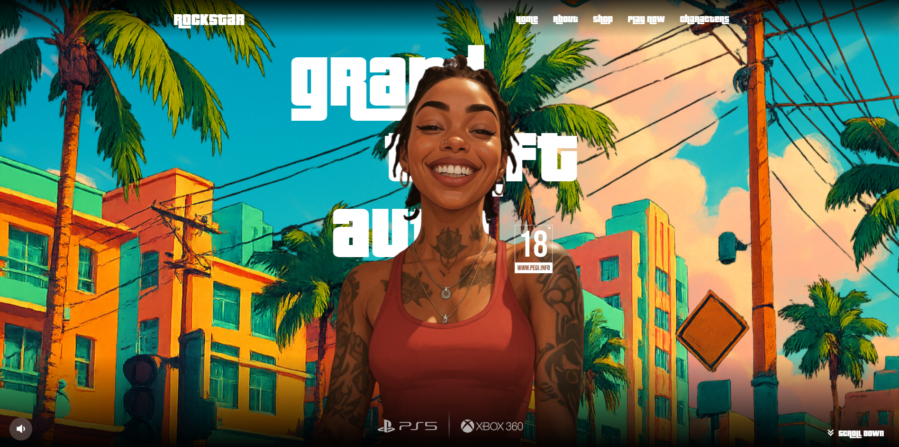

# GTA VI

A visually immersive website inspired by the GTA VI theme, built with modern web technologies. This project showcases a dynamic, interactive user interface using React.js, styled with TailwindCSS, enhanced with custom fonts, and animated using GSAP. Icons from React Icons and Remix Icons are integrated to add a polished, game-inspired aesthetic throughout the site.

## 🚀 Technologies Used

- React.js
- TailwindCSS
- GSAP

## 🌐 Live

- Netlify  
[Click here to see live website](https://the-gta-vi.netlify.app/)
- Vercel  
[Click here to see live website](https://gta-vi-unofficial.vercel.app/)

## 🖼️ Preview

  
